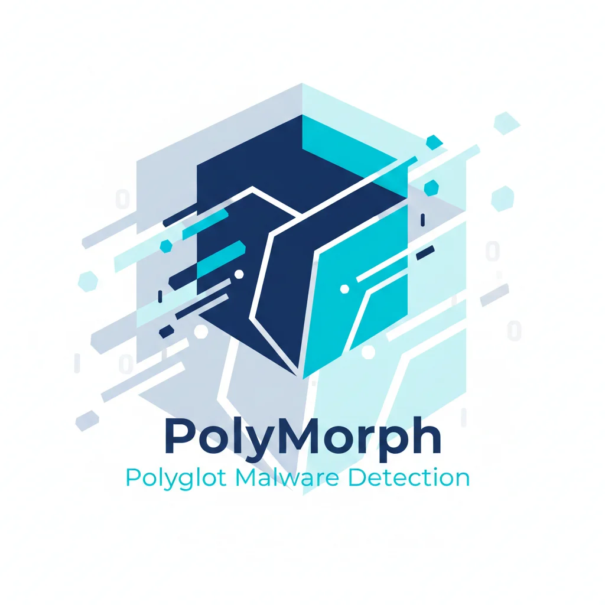

<div align="center">



# PolyMorph

**Open-source polyglot malware detector for APE, Zig, and WASM. Detect cross-platform threats, cryptominers, and evasion techniques that bypass traditional antivirus.**

[](https://www.rust-lang.org/)
[](LICENSE)
[](https://github.com/xonoxitron/polymorph)

[Features](#-features) • [Quick Start](#-quick-start) • [Examples](#-examples)

</div>

---

## 🚨 The Polyglot Malware Problem

Modern malware exploits **polyglot files** - binaries valid in multiple formats simultaneously - to evade traditional antivirus.

### The Threats

- **APE (Actually Portable Executable)**: Single binary runs on Windows/Linux/macOS/BSD
- **Zig Malware**: Direct syscalls bypass EDR (Hell's Gate, Halo's Gate)
- **WASM Cryptominers**: 75% of WASM modules are malicious (CrowdStrike, 2024)

### Research Shows Defenses Fail

- **20/36 detectors** bypassed by polyglots (Jana & Shmatikov, 2012)
- **90% evasion rate** against VirusTotal for WASM (Cabrera-Arteaga, 2024)

**No open-source tool detects APE + Zig + WASM together. PolyMorph fills this gap.**

---

## ⚡ Quick Start

```bash
git clone https://github.com/xonoxitron/polymorph
cd polymorph
cargo build --release

# Scan a binary
./target/release/polymorph suspicious.exe

# JSON output
./target/release/polymorph --json malware.wasm
```

---

## 💻 Examples

See `examples/` directory:
- `basic_scan.rs` - Simple file scanning
- `batch_scan.rs` - Multiple file processing

---

## 📚 Documentation

- [Quick Start](docs/QUICKSTART.md)
- [Architecture](docs/ARCHITECTURE.md)
- [WASM Detection](docs/WASM_DETECTION.md)

---

## 🤝 Contributing

Contributions welcome! See [CONTRIBUTING.md](CONTRIBUTING.md)

---

## 📜 License

MIT License - see [LICENSE](LICENSE)

---

<div align="center">

Made with ❤️ by the security community

[Report Bug](https://github.com/xonoxitron/polymorph/issues) • [Request Feature](https://github.com/xonoxitron/polymorph/issues)

</div>
